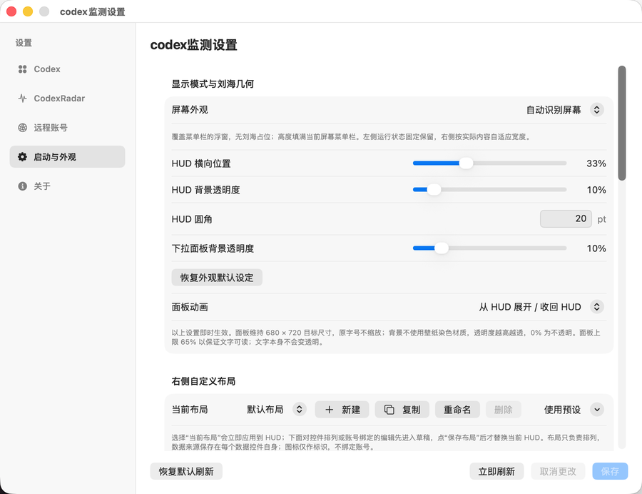
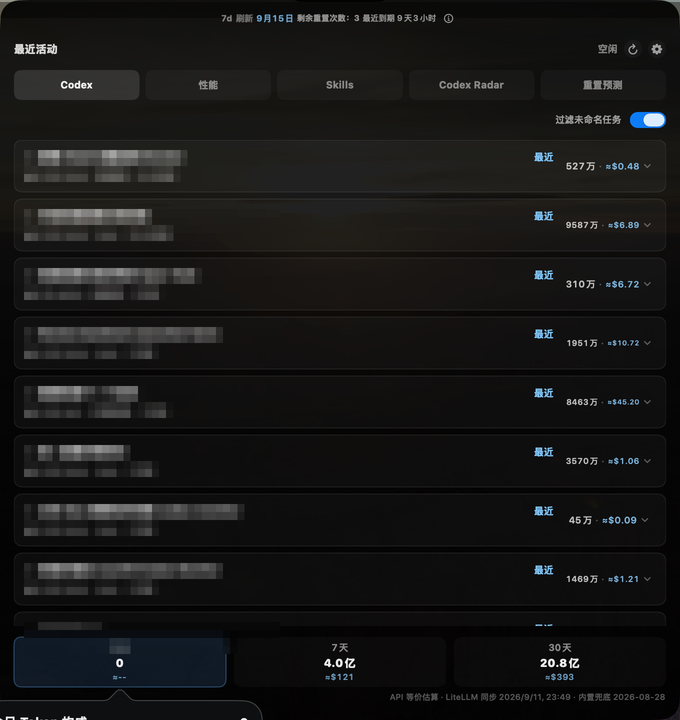
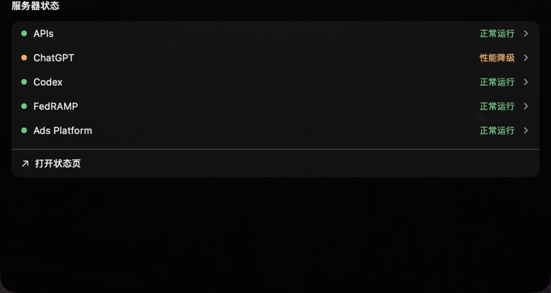
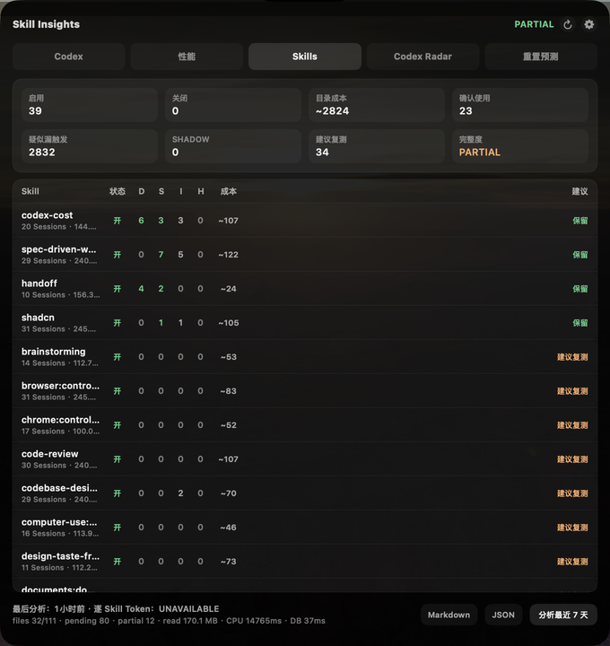
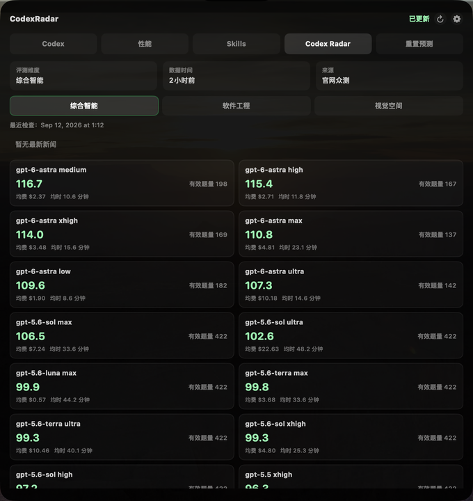
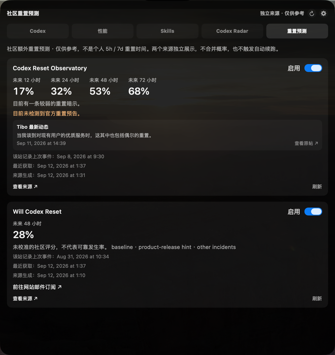
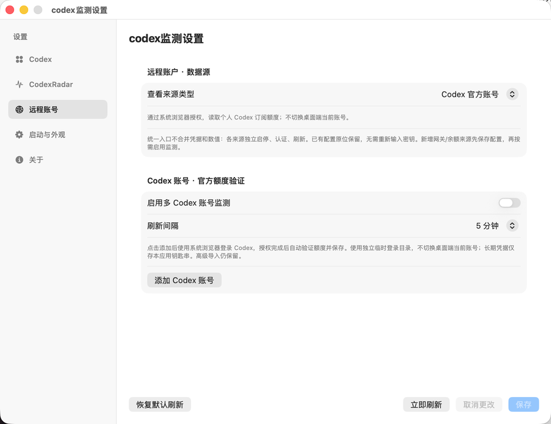
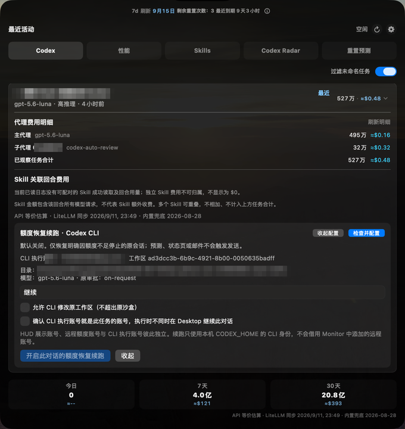

# Codex Monitor

原生 macOS 刘海屏 / 菜单栏监测工具：贴着 MacBook 刘海（或菜单栏）常驻显示 Codex 运行状态与额度，点击展开成灵动岛式详情面板，把本机用量、性能、Skills、公开评分、社区预测和远程账号放在一个窗口里。

    

项目以 [ALight777/codex-monitor](https://github.com/ALight777/codex-monitor) 原始源码为基线，在此基础上移植 [jackiemingnew/codex-monitor-macos](https://github.com/jackiemingnew/codex-monitor-macos) 的性能与 Skills 模块，并参考 [steipete/CodexBar](https://github.com/steipete/CodexBar) 的 HUD 控件思路与 [JiaYang-BUAA/Codex-Desktop-Usage-Monitor-Windows](https://github.com/JiaYang-BUAA/Codex-Desktop-Usage-Monitor-Windows) 的续跑状态机。**本项目不是从零原创**，来源与许可边界见 [NOTICE.md](NOTICE.md)。

---

## 截图

以下截图全部取自 0.4.3 实机运行的真实界面，按功能分布在本文件对应章节。对话标题已做马赛克处理；额度、用量、评分与公开状态是截图当时的真实数值，不代表长期结果。

刘海 HUD 收起态（左侧状态灯 + 右侧额度）：


---

## 界面结构

主面板六个标签：**Codex / 性能 / Skills / Codex Radar / 重置预测 / 远程账号**。

- 左侧固定显示本机 Codex 状态灯与 RUN/IDLE，右侧才是可自定义的内容区。
- 远程账号统一承载 Codex 官方账号、网关上游账号（CLIProxyAPI / CPA Manager Plus / Sub2API 管理端）、NewAPI 与 Sub2API 用户余额；各来源仍独立启停、独立保存配置，不合并认证方式，不把站点余额当作 ChatGPT 额度。
- 标签可见 ≠ 已启用网络数据源。所有联网能力默认关闭，按需打开。

---

## 主要功能

### 刘海 HUD 与菜单栏浮窗

- 贴合物理刘海显示：自动识别安全区并支持宽度微调，支持标准与窄刘海两种收起尺寸。
- 非刘海机型使用覆盖菜单栏的 `NSPanel` 浮窗（**不是** `NSStatusItem`），填满当前屏幕实际菜单栏高度，宽度默认上限 220 pt，可横向调整位置。
- 面板从 HUD 原位向外、向下展开并收回 HUD，展开过程文字不随面板缩放。
- 显示模式三选一：自动 / 刘海屏 HUD / 非刘海屏菜单栏浮窗。
- 透明度独立控制（0% 完全不透明，数值越大越透明），只作用于背景。
- 「恢复外观默认设定」一次性还原显示模式、刘海与浮窗几何、透明度、展开动画和运行指示灯动画。

### HUD 自定义布局

- 右侧内容区可自由编排：额度、范围或直接额度、节奏、重置控件、预计用尽、分隔点、空格（宽度可调）等，支持添加 / 移除、拖动排序、两行布局、按来源覆盖。
- **逐控件绑定账号**：每个控件可单独绑定本机或某个远程账号；未绑定的控件继续用默认数据源。
- 数据源不支持的控件显示 `—`，不会凭空新增 Codex 以外的供应商。
- 「恢复默认刷新」只重置本机 Codex 的平衡刷新频率，不改变账号、外观、布局或远程数据源。



### 本机 Codex 监测

- 运行状态（执行中 / 空闲）、活跃任务与活跃子代理数量、最近活动对话列表。
- 可用额度窗口剩余百分比；可选显示 GPT-5.3-Codex-Spark 专属窗口。
- 周额度行显示剩余重置次数，旁边显示最近一笔可用重置次数的**到期倒计时**（每分钟更新，到期后自动选下一笔未来时间）。日期缺失显示「未知」，不把到期时间冒充额度恢复时间。
- 每个对话的 Token 用量与 API 等价花费估算，包含其下的子代理用量；点击对话标题可展开主代理、各子代理与任务合计。
- 今日 / 7 天 / 30 天 Token 与费用：「今日」按本机时区自然日计算，归档会话仍计入已消耗 Token。
- Token 数字可整块悬停或点击：显示未缓存输入、缓存输入、含推理输出的构成，以及 API 等价估算与订阅扣费提示。
- 「实时接口优先」以接口返回额度为准；接口失败保留上次成功值并重试，本次运行无成功结果时才回退本地记录。
- 价格来自 [LiteLLM 公开价格表](https://github.com/BerriAI/litellm/blob/main/model_prices_and_context_window.json)（社区维护，非 OpenAI 官方实时接口），可按每小时 / 6 小时 / 每天 / 每周自动更新或手动更新，支持自定义同格式 HTTPS 源。该数字只是 API 等价估算，**不是账单**。



### 性能

- 本机 CPU / 内存采样：ChatGPT、Safari 宿主、WebKit 内容进程、WindowServer 等目标的 CPU 占用、常驻内存与进程数。
- 低能耗调度：按需降低采样频率，后台采样默认关闭。
- OpenAI 官方状态摘要、Codex 组件状态、事件与数据新鲜度；启用后读取固定公开状态接口，每五分钟刷新。
- 严重度分级（正常 / 警告 / 严重 / 不可用）与历史记录。

性能页下方的「服务器状态」展示 OpenAI 公开状态接口的各组件状态：



### Skills 诊断

- 读取本机 Skills 目录，列出 Skill 名称、描述、启用状态与目录体积 / Token 估算。
- 基于证据分层的观察：确认使用、推断使用、相关性匹配、替换信号、疑似漏触发、疑似误触发、影子匹配等。
- 逐 Skill 给出建议：保留 / 继续观察 / 继续关闭 / 建议复测 / 恢复候选 / 暂无证据。
- 数据质量标记（完整 / 部分 / 不可用），支持周报与 Markdown / JSON 导出。



> Skill 诊断是**证据推断，不是效果保证**；逐 Skill 精确 Token 不可得，不能与任务合计再次相加。

### Codex Radar

- 三个评分维度：综合智能、软件工程能力、视觉空间推理，默认综合智能并记住上次选择，切换不发起网络请求。
- 综合智能按官网规则，对同一模型档位按有效题量加权 IQ、平均费用与平均耗时；视觉空间显示覆盖题数。
- 展示官网最新公告新闻，可打开来源原文。
- 三个维度与新闻分别缓存；单来源失败保留其最后有效数据并标记，其他来源正常更新。
- 每小时及北京时间 08:20 / 14:20 自动检查，失败 5 分钟重试。
- 数据来自 [Codex 雷达](https://codexradar.com) 公开接口，可选 Token 仅用于补充授权接口提供的套餐额度。



### 重置预测

- 独立标签，两个来源**分别展示、分别启停、默认不联网**：
  - Codex Reset Observatory 的 12 / 24 / 48 / 72 小时社区预测；
  - Will Codex Reset 的 48 小时参考评分。
- 不做平均，不把社区事件当作个人额度恢复。来源过期或请求失败时保留上次结果并标记。
- Will 卡片只提供「前往网站订阅」入口，由系统浏览器打开。**本工具不读取邮箱、不申请邮箱权限、不接收或处理邮件。**



### 远程账号

- **Codex 官方账号**：支持手动填入 Access Token，或显式选择 `auth.json` 导入；也可通过本机 Codex app-server 发起官方网页登录（系统浏览器完成授权），验证额度通过后保存。
  - 登录进程使用独立临时 `CODEX_HOME`，不改动桌面端当前登录；只把验证通过的 Access Token 保存到本应用 Keychain，不保存 Refresh Token、不实现自动续期。
- **网关上游账号**：CLIProxyAPI、CPA Manager Plus、Sub2API 管理端账号池。
- **用户余额**：NewAPI 用户余额、Sub2API 用户余额。
- 支持多个命名账号、单独启停与刷新、堆叠展示；设置入口统一为「远程账号 → 添加数据源」，只统一入口，不合并认证方式。
- NewAPI 错误响应能区分 HTTP 451、浏览器安全验证、Cloudflare 1010、重定向、接口未找到与服务器异常，不把网页错误误报成 PAT 无效。
- **不额外接入 Codex 以外的供应商。**



### CLI 续跑（逐对话显式启用）

- 展开某个本机对话 → 检查并配置 → 核对账号、工作区、目录与权限 → 明确开启。可在额度耗尽前开启监测，或在已暂停后开启等待。


- 仅在满足全部条件时调用 `codex exec ... resume <精确会话 ID> -`：明确的官方额度耗尽失败、同一执行账号新额度恢复、原会话未改变。提示词通过 stdin 传递。
- 使用原数据目录的**文件型 ChatGPT CLI 登录**（需要 `auth.json` 的账号 / 工作区信息），不借用远程账户、API Key 或其他应用身份；Monitor 不直接改写登录文件。
- 默认 read-only；只有原任务允许 workspace-write 且用户确认后才允许工作区写入。不放宽原审批策略，不添加网络权限，不使用 `--yolo`。
- 预测、邮件和状态页**不参与触发**；每次额度事件最多发起一次，结果未知不自动重试。
- 纯 Keychain 登录、缺失权限 / 模型上下文、外部提供商或改写过的 openai 路由暂不自动续跑。令牌过期需用户在原 `CODEX_HOME` 重新登录。
- 退出 Monitor 会取消本应用的等待及其启动的 CLI，已发生的操作不回滚。对话被人工暂停 / 完成 / 继续、账号或模型配置改变时停止等待。

> 界面「CLI 已完成」不代表 Desktop 窗口已同步或任务质量已验收。跨 Desktop / CLI 的最后瞬间并发不存在原子锁，检查与应用私有锁只能降低竞争，不能保证跨客户端精确一次执行。

### 数据与导出

- 本机数据来自 `~/.codex/state_5.sqlite`、`~/.codex/logs_2.sqlite`、`~/.codex/sessions` 与 rollout JSONL 文件，**只读，不修改 Codex 数据**。
- 凭据默认存 macOS 钥匙串，缓存文件权限 `0600`。
- 支持快照导出（Markdown / JSON）。

---

## 安装

要求 **macOS 14+ / Swift 6**。

```bash
git clone https://github.com/yzin-17/codex-monitor.git
cd codex-monitor
./scripts/install.sh
```

- 已有旧版：先退出本项目的 Codex Monitor，再执行 `./scripts/install.sh --replace`。
- 安装到 `~/Applications/CodexMonitor.app`，覆盖前自动备份。
- Bundle ID `dev.yzin.codexmonitor`，凭据与派生目录独立。
- **未做 Apple 公证**，安装时不要关闭 Gatekeeper 或移除 quarantine；安装过程不会结束 Codex 或其他监控应用。

也可以从 Releases 下载 `codex-monitor-<版本>-arm64.dmg`（Apple 芯片）或 `-amd64.dmg`（Intel）。

---

## 开发

```bash
./scripts/test.sh     # Swift Testing 单元测试
./scripts/build.sh    # 构建并打包
```

- 原版入口 `scripts/build-app.sh` 与 `scripts/install-user-app.sh` 保留。
- 验收不含源码或补丁哈希检查，来源清单只用于归属记录；编译与行为测试照常执行。
- 测试只用合成数据与替身密钥库，不使用真实账号凭据。

---

## 隐私与安全边界

- 原始日志**只读**；不退出或重启 Codex，不注入 CDP，不新增上传对话或模型调用。**只读不等于离线**：网络功能按设置启用。
- 仅向已启用的固定 HTTPS 公开端点发起**无凭据 GET**。
- 不使用内嵌网页登录，不接入邮箱，不新增会话遥测；Codex 官方账号授权在系统浏览器完成。
- 安装不能关闭 Gatekeeper、移除 quarantine 或结束其他监控应用。
- 公共服务状态、社区重置预测、个人额度是**三个独立域**，不得互相替代或互相触发。
- 完整边界说明见 [SECURITY.md](SECURITY.md)。

## 已知边界

- 编译、单元测试与原生截图通过，不等于真实账户对账、长期性能、睡眠恢复、远程服务实连、Intel 实机运行和 Apple 公证已经完成——这些是**不同验收，不能互相冒充**。
- 真实浏览器授权与 Desktop 同步单独验收；CI 只验证合成协议。
- 文档截图取自实机界面（对话标题已打码），展示的是功能形态，不代表真实账户对账或长期稳定性已经验收。

---

## 来源与许可

- **ALight 基线**：[ALight777/codex-monitor](https://github.com/ALight777/codex-monitor) `ec9363d5`（v0.1.17）——UI、交互、统计、Radar、远程账号与设置。
- **Jackie 扩展**：[jackiemingnew/codex-monitor-macos](https://github.com/jackiemingnew/codex-monitor-macos) `6cd6c00a`——性能与 Skills。
- **参考**：[steipete/CodexBar](https://github.com/steipete/CodexBar)（HUD 控件与公开状态页思路）、[JiaYang-BUAA/Codex-Desktop-Usage-Monitor-Windows](https://github.com/JiaYang-BUAA/Codex-Desktop-Usage-Monitor-Windows)（续跑状态机）。
- 逐文件来源与变更哈希：[docs/UPSTREAM_LOCK.json](docs/UPSTREAM_LOCK.json)
- 许可范围与归属：[NOTICE.md](NOTICE.md) · [LICENSE](LICENSE)
- 上游详细说明：[ALight README](docs/upstream/ALight-README.md)
- 验收记录：[docs/VALIDATION.md](docs/VALIDATION.md) 及同目录各 `VALIDATION-*.md`
